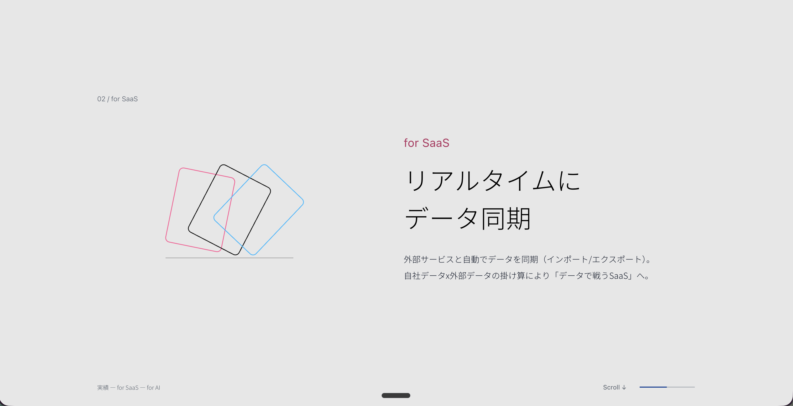
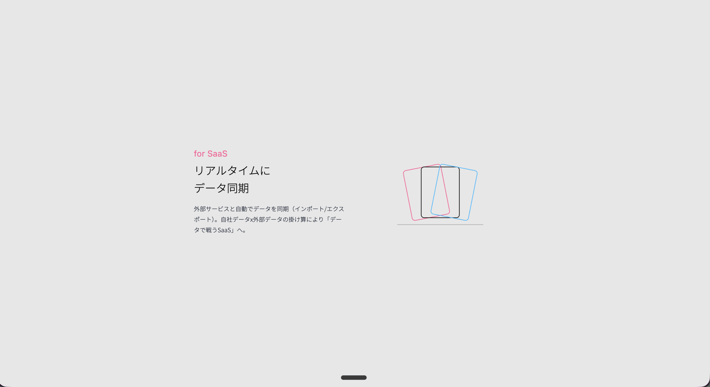

# Anyflow V4：6案のサイズ・構図・動き・前後の接続を再現する実装依頼

更新：2026-09-14。対象：**案1・4・5・6・7・9の全場面と、前後のページ全体**。

このMDは、そのままClaude Codeへ渡せる依頼書です。旧 `RESULTS-MOTION-HANDOFF.md` を補強し、特に「現行を維持する」の範囲を明確にします。このMD単体で実装方針と各案の目安が分かるようにしています。

> **現行のデータ・ブランド表現・ピクト内部の動き・ビジョン・開発者体験・グラデーション遷移は維持してください。一方、実績内の構図、文字の大きさ、図の表示サイズ、画面占有率、動きの始点・終点・読む区間は、このMDの案別仕様へ合わせてください。「動くが全体が小さい」状態は再現完了ではありません。**

以下の「現行」は、Claude Code側の最新の確定実装と、実行時に有効な設定を指します。古いスナップショットではありません。6案は独立した比較候補です。1ページへ6種類の演出を重ねる指示ではありません。本番を上書き・デプロイせず、現在のページ全体が入ったローカル比較ページで確認できるようにしてください。

## 1. 今回直したいずれ

横に移動する、図が縮む、といった動作だけでなく、**何をどの大きさで見せて、どの位置に収め、どの余白の中で読ませるか**を再現してください。これは添付のSaaS場面だけの修正ではありません。

添付画像の実測は以下です。画面外枠や補助UIを除き、文字・図の描かれた部分の横幅を画像全幅で割りました。CSSのコンテナ幅ではありません。

| 比較項目 | 画像1：意図したサンプル | 画像2：Claude側の実装 | 読み取れる差 |
|---|---:|---:|---|
| 主コンテンツの描画範囲の横幅 | 約61.0% | 約40.7% | 画像2は横方向の存在感が約2/3 |
| SaaS見出しの文字が描かれた横幅 | 約21.8% | 約10.6% | 同じ文言でも画像1は約2.1倍 |
| ピクトの有彩色の線が描かれた横幅 | 約17.5% | 約10.5% | 画像1は約1.7倍。内部アニメの位相による変動あり |
| 本文の描画範囲の横幅 | 約30.9% | 約21.1% | 画像1は広く、同じ本文が2行／画像2は3行 |
| 左右の順序 | ピクト → 文章 | 文章 → ピクト | サイズ以外に構図も異なる |

画像1は3020×1548px、画像2は3014×1646pxです。撮影範囲の高さが違うため、縦の占有率をそのまま比較していません。`@2x`というファイル名だけで実際のCSS viewportやブラウザー倍率を断定せず、画像の文字の高さをCSSのfont-sizeと扱わないでください。表は画像の指定領域を色・明度で抽出した概測です。余白を含むDOMボックスの値と混ぜないでください。

**起きているずれを説明するコード上の手がかり：** 2026-09-14に読んだ `anyflow/v4/index.html` には、案1の文章幅360px・図枠300px・間隔72px、および共通の `.r2v-h { font-size:26px }` がありました。サンプルの案1は文章幅490px・図枠約504×360px・間隔80px・見出し48pxです。さらに既存の `.pin-stage` には `scale(var(--sp))` があります。これらは確認時点のコード値であり、添付画像2の実行時のcomputed styleを取得したという意味ではありません。**現行値を継承するだけで済ませず、親のscaleまで含めて画面上の最終サイズを確認**してください。

## 2. 優先順位：維持と変更の境界

| 対象 | 正とするもの | 実装時の扱い |
|---|---|---|
| コピー、実績数値、文意 | Claude側の最新データ | サンプルの古い数値・補足コピーへ差し替えない |
| 書体、ウェイト、ブランド色、基本の字間、線の表情 | Claude側の最新確定仕様 | 大きさの違いをフォント変更や太字化で代用しない |
| ピクトの形状・線・配色・内部の動きと速度 | Claude側の最新ピクト | 元のコンポーネントを再利用。外側の配置・表示サイズを案別に変更 |
| **実績内の文字サイズ・行間・文字と本文の大小比** | **このMDの案別目安** | **変更対象。現行の26px等を無条件に残さない** |
| **実績内の列幅、左右上下の順序、図枠、間隔、画面占有率** | **このMDの案別構図** | **変更対象。既存の小さな1画面レイアウトに押し込めない** |
| **実績のスクロール演出と読む区間** | **このMDの場面表** | 現行のスクロール管理へ接続。演出全体を通して再現 |
| KV、Our Vision、その前後の要素 | Claude側の最新実装 | 現行の内容・寸法・演出を丸ごと残す |
| 実績から開発者体験へのグラデーション、白反転 | Claude側の最新実装 | 本書5章の接続条件を満たして再利用 |
| Strength 01／02、コード生成、API／CLI／SDK、導入事例以降 | Claude側の最新実装 | 簡易サンプルで置換しない。後続を含めて確認 |

実績用の値は案の範囲へ限定して定義してください。全体のデザイントークンや `.pin-stage` 共通スタイルを一括変更しないでください。既存のフォント・字間を使うと改行が変わる場合は、まず実績内の列幅と余白を調整し、それでも必要なサイズ差を報告してください。

## 3. 数値の読み方と測定条件

### 出典と基準画面

- **実測**：ローカルサンプルのDOMの `getBoundingClientRect()` と `getComputedStyle()` で確認した値。PCは **1440×900 CSS px**、スマホは **390×664 CSS px**。2026-09-14計測。
- **原本値**：サンプルのCSS／JSから取得したサイズ、スクロール尺、進捗の配分。既存実装へ同じコードを貼る指示ではありません。
- **提案目安**：異なる書体・ヘッダー・画面寸法へ適応するときの許容幅と判断基準。確定デザイン値を取得したものではありません。
- 以下のpxは、特記がない限りCSS pxです。画像の物理ピクセルと区別してください。

`W = window.innerWidth`。`B = 画面上部を実際に覆う固定UIの高さ`。`H = window.innerHeight - B` を、読める表示領域の高さとします。サンプルの比較バーはPC52px、スマホ92pxなので、測定時のHは848px／572pxでした。**比較バーは本番へ移植せず、52・92を本番の予約高さとしてコピーしない**でください。現行ヘッダーが退場する場面なら、その場面のBは0です。

表中の `%W` は画面全幅、`%H` は上記の読める高さに対する割合です。x位置は画面左端から、y位置は固定UIの下端から測ります。PCで重要なコンテンツを画面中央付近に置くという意図を保ち、撮影画像のy座標をそのまま固定しないでください。

### 共通の横幅

PCの主コンテンツ幅Cは、サンプルでは最大1138pxです。

| 画面の横幅W | C | 画面に占める幅 | 左右余白（片側） |
|---|---:|---:|---:|
| 1280 | 1138 | 88.9% | 71px／5.5%W |
| 1440（基準） | 1138 | 79.0% | 151px／10.5%W |
| 1510（添付との比較用の幅） | 1138 | 75.4% | 186px／12.3%W |
| 1920 | 1138 | 59.3% | 391px／20.4%W |

これは最大幅のある構成です。「全画面幅の79%」をすべての画面で強制するという意味ではありません。原本のPC幅は通常 `min(1138px, W - 120px)`、横スクロール面は `min(1138px, W - 140px)`。中間幅・スマホでは別の余白へ切り替わります。スマホ390pxではC=350px、左右20px、89.7%Wでした。

**Cだけ合っていても不十分です。** Cの内側に小さな図と文章を中央寄せすると、今回と同じずれが起きます。図枠・文章幅・見出し・描画された図の範囲まで併せて確認してください。ピクトはSVGのviewBox内に余白があるため、図枠の幅と見える線の幅は違います。

### サイズの合否の目安〔提案〕

同じviewport、同じ場面、同じフォント読込状態で、主コンテンツ幅・文章幅・図枠幅は表の値から**±5%程度**、主なx位置は**±2%W程度**、見出しサイズは**±5%程度**を最初の照合範囲にしてください。本文はPC14〜16px、スマホ原則14px以上を提案基準とし、1画面に収めるために縮小し続けないでください。

この許容幅は実装時の調整目安であり、依頼者による最終承認値ではありません。文言の更新・実際の書体・視認性のために超える場合は、数値と理由を残して比較できるようにしてください。

## 4. 全6案の構図と場面ごとの仕様

スクロール進捗 `p=0〜1` は**実績全体で一律の値ではなく、各固定場面の開始から終了まで**の正規化値です。自然に流れる部分は、無理に同じ進捗へ押し込めないでください。

固定場面の原本では `p = clamp((B - track.top) / (track.height - H), 0, 1)`。現行の構造に合わせて同じ意味の進捗を作ってください。`svh`の尺はセクション全高であり、実際の固定中の移動距離はそこからHを引いた長さです。各案の**読む区間の後**に、既存グラデーションへの接続区間を設けます。

### 案1：余韻をつくる横パノラマ

参考：[案1](http://127.0.0.1:8781/mock/results-1/)

**構成：Visionの縦スクロール → 実績の1面 → SaaSの1面 → AIの1面 → 現行のグラデーション → 開発者体験。**

各面は幅W、高さHの表示領域を共有し、中身はCへ収めます。SaaSとAIは、**左にピクト／右に文章**。実績面を含む全3面を対象とし、SaaSの静止画だけを合わせないでください。

| PCの要素 | 実測／原本の目安 |
|---|---|
| 実績面の主見出し | 46px、行間1.6。PCでは1行の構成 |
| 連携実績の主数値 | 150px、行間1.08。ほかの指標72px。主数値は約2.08倍 |
| 見出し→数値 | 44px。主数値とほかの指標の領域間は55px以上 |
| SaaS／AIの主コンテンツ | 横1138px／79.0%W。図と文章の列間80px |
| 左の図枠 | 約504×360px／35.0%W × 42.5%H |
| 右の文章枠 | 最大490px／34.0%W。左端x≈51.0%W |
| タグ／価値の見出し／本文 | 22px／48px／16px。見出し対本文3：1 |
| 見出し | 2行、行間72px、2行の行ボックス高144px |
| タグ→見出し／見出し→本文 | 20px／28px |
| 本文 | 行間31.2px。参照時点のSaaS・AIのコピーはそれぞれ2行が目安 |
| 図＋文章の縦位置 | 図枠の中心は読める高さの約52%。図＋文章の行全体は高さ360px／42.5%H |

比較専用の「02 / for SaaS」などを削除しても、Cや見出し・図のサイズを縮めないでください。添付画像1の構図が、この案のSaaS読書状態の補助基準です。図枠が約35%Wでも、実際の色線は添付で約17.5%Wでした。

| 場面 | pの原本目安 | 状態 |
|---|---:|---|
| 実績を読む | 0〜0.156 | 3指標と主見出しが揃う。横移動0 |
| 実績→SaaS | 0.156〜0.363 | 横へW分移動。図・文章の基準サイズは維持 |
| SaaSを読む | 0.363〜0.526 | 面が中央で停止。文字を漂わせない |
| SaaS→AI | 0.526〜0.733 | さらにW分移動 |
| AIを読む | 0.733〜1 | AI全文が見える静止区間。その後に遷移へ渡す |

原本のセクション高450svh。移動区間はsmoothstep相当の加減速、保持区間は移動量一定です。これは参考の配分です。現行のスクロール尺へ調整しても、3つの読む区間を省略しないでください。

### 案4：ピクトが語る二つの価値

参考：[案4](http://127.0.0.1:8781/mock/results-4/)

**構成：主見出し → 左SaaS／右AIの大きな図と言葉 → 下部の実績指標 → 現行遷移。通常の縦スクロールです。**

| PCの要素 | 実測／原本の目安 |
|---|---|
| 全体幅 | C=1138px／79.0%W |
| 主見出し | 37px、行間1.6、中央。見出しの後16pxで2領域へ |
| 2領域 | 各列533px、列間72px。右領域の境界線後の内余白72px |
| 各ピクトの枠 | 280×244px／19.4%W × 28.8%H。文章の**上**に中央配置 |
| 図→文章 | 8px。各文章枠最大420px／29.2%W |
| タグ／価値の見出し／本文 | 20px／34px／15px。見出し対本文約2.27：1 |
| 見出し／本文の行間 | 49.3px／28.5px。見出し2行、SaaS本文3行が参照目安 |
| 価値の領域の高さ | 約490px／57.8%H。本文も含む |
| 価値→実績指標 | 40px＋罫線＋上余白30px。数値46px、ラベル12px |
| セクション全高 | PC実測約829px。1画面への強制縮小はしない |

登場は主見出し→図と言葉→実績指標の順。原本の出現は下22pxから0、opacity 0→1、opacity約0.85秒／位置約1秒、要素ごとの遅れ約0.14〜0.4秒です。**読める完成状態では全要素が等倍・不透明**になります。実績指標が出るまでピクトと言葉を消さないでください。入り始め、図と言葉が揃った状態、数値まで揃った状態、末尾の本文を通過する状態を確認します。

### 案5：実績を残す、二つの横景色

参考：[案5](http://127.0.0.1:8781/mock/results-5/)

**構成：上部の主見出しと下部の実績指標を残し、中段だけSaaS→AIへ横移動。** 図は左、文章は右です。実績を1枚目として退場させる案1とは異なります。

| PCの要素 | 実測／原本の目安 |
|---|---|
| 主見出し | 33px、中央。上部の読み始め位置は約5%H |
| 中段の幅／高さ | 1138×320px／79.0%W × 37.7%H |
| 図枠 | 約577×320px／40.1%W。列比1.2：1、列間80px |
| 文章枠 | 約481px／33.4%W。左端x≈56.1%W |
| タグ／価値の見出し／本文 | 22px／48px／16px。見出し2行、行間72px、本文行間31.2px |
| タグ→見出し／見出し→本文 | 20px／28px |
| 中段の縦位置 | 図枠上端≈29.1%H、中心≈48.0%H |
| 下部の実績帯 | C幅。実測高さ約85px／10.0%H、上端≈83.9%H |
| 実績帯の数値／ラベル | 44px／12px。3指標を横に配置。ラベルと数値の間24px |

| 場面 | pの原本目安 | 状態 |
|---|---:|---|
| SaaSを読む | 0〜0.247 | 中段停止。上下の見出し・指標も停止 |
| SaaS→AI | 0.247〜0.576 | 中段だけ横へW分移動。図に小さな視差 |
| AIを読む | 0.576〜1 | 中段停止。上下の見出し・指標を残したまま読む |

原本のセクション高330svh。図の視差は `65px × (面の移動位置 − その面の番号)`、移動の中点では約±32.5pxです。**移動が止まった面は図の視差も0**。大きな別方向の飛び出しへ変えず、本文を読む間は全体を固定します。上下の帯まで横へ送ったり、価値の見出しを帯の33pxに揃えたりしないでください。

### 案6：ピクトを、主役の大きさへ

参考：[案6](http://127.0.0.1:8781/mock/results-6/)

**構成：実績見出し＋指標 → SaaSの大きな図 → 図が収まって説明 → AIでも同じ流れ → 現行遷移。** SaaSからAIへは縦に進みます。

| PCの要素 | 実測／原本の目安 |
|---|---|
| 導入の主見出し／数値 | 40px／88px。間隔48px。導入領域は高さ約391px |
| 読書状態の列 | 幅C、左約567px／右約506px、列間65px |
| 図枠：入り口 | **約794×588px／55.1%W × 69.3%H** |
| 図枠：説明時 | **約567×420px／39.4%W × 49.5%H** |
| 図の外側の拡大率 | 1.4 → 1。上の図枠寸法は親transform適用後 |
| 図枠中心：入り口→説明時 | x≈42.0%W → 30.2%W。左側へ収まる |
| 文章枠 | 約506px／35.1%W。左端x≈54.4%W |
| 価値の見出し／本文 | 44px／16px。行間66px／32px。間隔30px |
| ピクト上のfor SaaS／for AI | 25px。図の説明用の重複ラベルは持ち込まない |

| 各ピクト場面 | pの原本目安 | 状態 |
|---|---:|---|
| 図が主役 | 0〜0.08 | 1.4倍、文章opacity 0 |
| 図が収まり説明が現れる | 0.08〜0.50 | 図1.4→1、横位置30%→0（図の元の幅に対して）。文章は下40px→0、opacity 0→1 |
| 説明を読む | 0.50〜1 | 図等倍、文章完全表示で停止。内部のピクトアニメは現行を継続 |

SaaS・AIはそれぞれ原本190svh。進捗0.29付近の中間はsmoothstepの約半分で、図約1.2倍、文章opacity約0.5です。**「最初だけ大きく、止まると小さなアイコン」ではありません。説明状態でも図枠は約39%W**です。全体を1枚の小さなカードに戻さないでください。

### 案7：言葉をなぞる、スクロール

参考：[案7](http://127.0.0.1:8781/mock/results-7/)

**構成：メインメッセージを大きく読む → 実績指標 → SaaSの説明 → AIの説明 → 現行遷移。** 冒頭の文字演出だけでなく、後続の指標・説明を別の段として展開します。

| PCの要素 | 実測／原本の目安 |
|---|---|
| 主見出し | **88px**（1440幅）、行間140.8px。1280幅では79.36px |
| サイズの原本式 | `clamp(38px, 6.2vw, 88px)`。PC用。実績内だけに適用 |
| 主見出しの枠 | C幅。2行の行ボックス高約282px／33.2%H |
| 改行 | 「事業の推進力を、」／「Anyflowが支えます。」の2段 |
| 数値の段 | C幅、数値88px。上余白65px、下余白90px |
| SaaS／AIの各説明段 | 各高さ660px以上、上下余白90px。長文なら自然に伸ばす |
| 説明段の列 | 左ラベル約145px／中央文章約542px／右ピクト約361px。列間45px |
| 文章／ピクトの位置 | 文章x≈23.6%W、ピクトx≈64.4%W。**この案はピクトが右** |
| ピクト枠 | 約361×330px／25.1%W × 38.9%H |
| 価値の見出し／本文 | 40px／16px。本文幅最大420px。行間68px／32px |
| 下線 | 原本は高さ5px、見出し下辺に沿って0→100%。色は現行ブランドから選ぶ |

冒頭の固定領域は原本180svh。p=0でも文章全体が読める濃淡で存在し、0〜0.78で文頭から順に強調、0.78〜1は全文を読める状態を保持します。文字を1文字ずつ追加するタイピングにはしません。文字分割で英字フォント、カーニング、字間、改行を変えないでください。

指標以降は自然な縦スクロール。各説明の下線は、その段が画面へ入る進み具合に連動します。原本は `q=(viewport高さ−段の上端)/(viewport高さ＋段の高さ)` の0.12〜0.62で伸びます。本文を消したり、全部読む前に次の段へ強制切替したりしないでください。

確認する状態は、冒頭の強調前／約半分／全文、指標が見える段、SaaSの下線途中／完了、AIの下線途中／完了です。**普通の34pxの見出しをそのまま色替えするだけでは、この案の存在感は再現できません。**

### 案9：数字からひらく、実績

参考：[案9](http://127.0.0.1:8781/mock/results-9/)

**構成：連携実績の大きな数字 → 数字が収まり主見出し・残り2指標が揃う → 下段にSaaSとAI → 読む区間 → 現行遷移。**

| PCの要素 | 実測／原本の目安 |
|---|---|
| 主コンテンツ | C幅。数字は左を基点に展開 |
| 連携実績の数字：入り口 | font-size142px × 外側scale1.45 = **見た目約206px相当** |
| 同数字：説明時 | font-size142px × scale1 = **142px相当** |
| 数字＋の表示ボックス | 初期約707px／49.1%W → 終了約487px／33.8%W（参照時の20,000+） |
| 主見出し／ほかの数字 | 34px／64px。主数字とほかの数字は終了時約2.22：1 |
| 数字ブロックの移動 | 下45px→0。拡大基点は左中央 |
| 見出し→指標／指標→価値 | 28px／30px＋罫線＋上余白25px |
| 下段の価値領域 | 1138×約237px／79.0%W × 27.9%H。2列、列間40px |
| 各領域の文章と図 | 文章左・図右。SaaSの文章枠約389px、図140×155px |
| タグ／価値の見出し／本文 | 20px／26px／14px。見出し行間41.6px、本文26.6px、間隔12px |
| 全体が揃った領域 | 主見出しの上端〜価値の下端が約543px／64.0%H |

この案は**数字が主役で、ピクトは補助**です。案6の巨大ピクトの寸法を流用しないでください。図のサイズが案1や案6より小さいこと自体は意図通りですが、数字まで同時に小さくしないでください。

| 場面 | pの原本目安 | 状態 |
|---|---:|---|
| 大きな数字を見せる | 0〜0.07 | 1.45倍。主見出し・残り指標・価値の説明はまだ見せない |
| 数字が収まる | 0.07〜0.47 | 1.45→1、下45px→0。主見出しと残り指標が出現 |
| 価値が現れる | 0.43〜0.69 | 下35px→0、opacity 0→1。前の動きと少し重なる |
| 全体を読む | 0.69〜1 | 数字と2つの価値が揃って停止 |

原本235svh。新しいカウントアップを足さず、既存のスロット等と競合させないでください。拡大するのは意図した数字領域であり、不可視の親ボックスがWを超えても、ページ全体の横スクロールを発生させないでください。数字の実データが変わったら表示文字幅で確認します。

## 5. ページ全体：Visionから開発者体験、後続まで

**「全体を入れる」は、現行のページを途中で簡略化しないという意味です。サンプルのVision・黒い接続セクション・静止エディタを新しい正として移植することではありません。** 以下を全6案に共通で適用します。

### 全体の比較地点

| 地点 | 残すもの／合わせるもの | 比較する寸法・状態 |
|---|---|---|
| ヘッダー・KV・Visionより前 | 現行そのまま | 幅、文字サイズ、図の比率、表示順、スクロール挙動 |
| Our Vision入口 | 現行そのまま | 見出しのx/y、幅、高さ、改行、前の段との余白 |
| Visionの主ビジュアル | 現行そのまま | 描画範囲の%W/%H、中心、ラベル位置、内部の動き |
| Visionの説明・末尾 | 現行そのまま | 本文幅・行数、説明の出る順、最後まで読める状態 |
| Vision→実績入口 | 前半は現行、実績側は各案 | 意図しない巨大な空白、ヘッダーとの衝突、二重pinがない |
| 実績の各場面 | 本書4章 | 入り口・中間・読書状態・次の面への移動・末尾をすべて照合 |
| 実績末尾→暗転 | 読書完了後に現行遷移へ接続 | 最後のAIまたは説明全文を読む前に暗転しない |
| グラデーション途中 | 現行の遷移を再利用 | 背景の色・方向・濃度分布、文字・タグ・図・線の同期 |
| Strength 01とコード生成 | 現行そのまま | 見出し・コード画面の%W/%H、登場位置、ブラー・フェード、実際の生成演出 |
| Strength 02とAPI／CLI／SDK | 現行そのまま | コード／説明の列比、各画面の寸法、既存の切替・移動・読む時間 |
| 導入事例、後続、フッター | 現行そのまま | 全セクションの存在、配置、背景、スクロールで到達できること |

維持対象にサンプル由来の新しい固定数値を指定すると、現行の良い実装を壊します。そのため、**ここはClaude側で変更前の値を取得して、それを各案へそのまま引き継ぐ**方式にします。次の記録表を、共通で1回作成してから作業してください。

| 維持対象 | viewportと場面 | 現行の幅・高さ・x/y・font/line-height | 案の実装値 | 差 |
|---|---|---|---|---|
| Vision見出し・図・説明（各要素を別行にする） | PC／SP・入口／主場面／出口 | 実測して記入 | 実測して記入 | 記入 |
| Strength 01見出し・コード画面 | PC／SP・登場／完成 | 同上 | 同上 | 記入 |
| Strength 02見出し・API／CLI／SDK | PC／SP・各場面 | 同上 | 同上 | 記入 |
| 導入事例以降の主要要素 | PC／SP・各場面 | 同上 | 同上 | 記入 |

この表の空欄は「未計測」であり、0pxや自由に変更してよい値ではありません。本MD作成時にはClaude側の最新実行画面を一式実測していないため、ここに架空の確定値を入れていません。コードが並行更新されるので、実装開始時の基準を採ってください。

### グラデーションを守る接続仕様

1. 現行で実際に有効な遷移モードと設定を確認する。焼き込み値だけでなく、保存値・プリセット・調整パネルの上書きを含める。
2. 各案の最後に「全文が所定の大きさで見え、外側の移動が止まる区間」を確保する。そこから既存の遷移へ引き渡す。末尾の要素を消して空白をつくってから暗転させない。
3. 現行の背景グラデーションの色、向き、範囲、濃度の変化と暗転カーブを維持する。サンプルの下から伸びる黒板、中央から開く矩形、ベタ黒の段へ置換しない。
4. 現行の背景の暗さに、実績の文字・数字・タグ・ピクト・罫線を同期する。案5の固定見出し／指標、案7の文字強調／下線など、新たに動かす要素も対象にする。
5. 全画面背景や開発者体験を横移動用のtransform要素へ入れない。fixedの基準、clip、z-index、親のscaleの影響を確認する。
6. スクロール尺に応じて入口・出口の位置を接続し直してよい。ただし、既存のグラデーション曲線や開発者体験内部のタイミングをその場しのぎで短縮しない。
7. 逆スクロールでも同じ状態へ戻す。白い空白、二重の暗幕、急な黒背景への切替、文字だけ暗い状態を出さない。

遷移は**開始／25%／50%／75%／完了**を変更前と比較してください。この割合は既存の遷移自体の進捗であり、暗さが25%になるという意味ではありません。実績の尺が変わるため、同じページscrollYで比較せず、**同じ遷移進捗**へ合わせます。後続の要素も、ページ内絶対Yではなく、そのセクションで同じ場面になったときのviewport内位置と寸法を比較します。

現行コードを追う手がかりは `resSmooth()`、`updateResults()`、`updateDev()`、`devDarkK`、`.dev-bg`、`--surface-dark-top`／`--surface-dark-bottom` です。確認したコードでは `updateDev()` が扱う背景の暗さに、実績側の白反転が追従します。名前は実装時に再確認し、古い設定値の再投入には使わないでください。

## 6. スマホと短い画面

PCをそのまま縮小したミニチュアにしないでください。横幅390pxのサンプルは以下でした。ここは**参照実測**と**実装時の推奨調整**を分けています。現行のブランド・書体・ピクト内部・前後のスマホ画面はそのまま使います。

| 案 | 390×664でのサンプル実測 | 実装時に残す意図・調整 |
|---|---|---|
| 1 | 本文幅350、図250×190、価値見出し29、本文14。図上／文章下 | 横移動中も各面を縦積みにする。数値面の主数字は約94px、ほか49px。3場面の読む区間を維持 |
| 4 | 図275×228、価値見出し32、本文14、指標36。セクション高約1349 | SaaS／AIを縦に並べ、自然に最後までスクロール。1画面に圧縮しない |
| 5 | 固定主見出し24、図235×145、価値見出し25、本文13、指標33 | 上下の固定帯を保つ。本文は14px以上を提案し、高さが足りなければ余白・固定方式を調整。13pxへ固定する指示ではない |
| 6 | 説明時の図300×220、価値見出し28、本文14 | 図上／文章下。入口の拡大は画面から切れない範囲で調整し、収まった後も図を大きく残す |
| 7 | 主見出し33.54、価値見出し33、本文14、図330×250、指標40 | 冒頭の強調後、各説明は自然な縦流れ。全文を読む途中で固定領域から追い出さない |
| 9 | 主見出し26、主数字68、ほか28、図280×230、価値見出し29、本文14 | サンプルは600px以下で固定とズームを解除し1列の縦流れ。2つの説明を小さな2列へ押し込めない |

PCの主要比較サイズは1440×900と1280×720、スマホは390×664、さらに縦が短い390×560でも確認してください。全6案に「入り始め」「中間」「読み終わり」を用意します。スマホで大きな演出を簡略化する場合は、その差を明示してください。**全案を無言で現行へフォールバックし、スマホの比較実装まで完了した扱いにはしない**でください。

文字量や固定ヘッダーにより1場面がHへ収まらない場合は、文字を縮めずに自然な縦スクロールへ切り替えるのを提案基準とします。参考の高さ600px以下のフォールバックを出発点にできますが、実際の内容の高さで判断してください。動きを抑える設定では全内容を読める通常の文書へ戻し、最初の面だけ表示して残りを隠さないでください。

## 7. 実装手順と再現の確認

1. 最新の実装・データ・保存設定の所在を確認し、変更前のページ全体をPC／スマホで記録する。修正対象の実績と、維持する共通部分を区別する。
2. **まず各案の読書状態を静止させて、寸法・左右上下の順序・改行・図の描画サイズを合わせる。** この状態が小さいまま動きを足さない。
3. 次に入り口のサイズと位置、中間、停止位置を合わせる。案6は大きな入口と大きさを保った終点、案9は数字の拡大前後を別々に測る。
4. 場面表の読む区間を組み込み、通常の縦スクロールで進める。クリック、タブ、矢印ボタン、横スワイプ必須の操作は内容を読む条件にしない。
5. 現行のスクロール更新へ接続する。別のエンジン・二重のrequestAnimationFrame・二重のタイピング等を足さない。図の内部の動きと外側の移動は別のラッパーで管理する。
6. 最後に既存のグラデーションと後続セクションへ接続し、本書5章の全体比較を行う。案4・7の自然な流れを含め、末尾を読み終える位置から接続する。
7. 保存値の影響を確認する。既定・焼き込み・ブラウザー保存・案別保存・migrationを検索し、古い保存値を入れた状態からリロード2回でも狙いの表示になることを確認する。比較設定を元の現行案へ書き戻さない。
8. 各案のローカルURL、比較画像、数値表、現行を維持した箇所、意図的に変えた箇所、未確定の提案値を報告する。

### 計測で落としやすい点

- `getComputedStyle(el).fontSize` は親transformによる縮小を含まない。48pxと表示されても、親scale0.7なら見た目は約33.6px相当です。対象要素の画面上の矩形と親のtransformを確認してください。
- pin-stageの設計座標で1138pxあっても、画面上の幅が1138pxとは限らない。表は原則、**画面に表示された結果**との比較です。
- SVGの外枠と、実際に描かれた線・図の範囲を別々に見る。透明な余白だけが大きい状態で「図枠が一致」と完了しない。同じ図のアニメ位相、または1周期の描画範囲で比較する。
- フォント読込前、フェードの途中、サムネイル用の縮小表示、ブラウザー倍率が異なる状態で比較しない。
- 参照時点のコピーは測定の補助。最新版の文言を削って行数だけを一致させない。文字量による行数差は記録し、読める高さを確保する。

### 納品時の比較表

| 案・場面・要素 | viewport | 本MDの基準 | 実装の画面上の実測 | 判定／調整理由 |
|---|---|---|---|---|
| 1・SaaS読書・文章幅 | 1440×900 | 490px／34.0%W | 記入 | 記入 |
| 1・SaaS読書・見出し | 同上 | 48px、行間72px、2行 | 記入（親scaleも） | 記入 |
| 4・全表示・図枠 | 同上 | 280×244px | 記入 | 記入 |
| 5・AI読書・実績帯 | 同上 | 1138px幅、数値44px、固定 | 記入 | 記入 |
| 6・図の入口→説明時 | 同上 | 約794×588 → 567×420px | 両方記入 | 記入 |
| 7・冒頭の全文 | 同上 | 88px、2行 | 記入 | 記入 |
| 9・数字の入口→説明時 | 同上 | 見た目約206 → 142px相当 | 両方記入 | 記入 |
| 全案・遷移中間 | 同上 | 現行の同じ遷移進捗 | 背景と全要素の同期を記入 | 記入 |

上の表は最低限の行です。各案の主見出し、数値、SaaS、AI、図、本文、主要余白、スマホ、共通前後の要素まで追加してください。「だいたい合っています」だけで終わらせないでください。

**完成条件：全6案の始点・途中・読書状態・終点が意図した大きさと構図になり、現行のビジョンからグラデーション、開発者体験、後続までの完成度を保った全ページで比較できること。**

## 8. 参照元と持ち運び

- サンプル一覧：[全案の比較](http://127.0.0.1:8781/mock/results/)。同じMacでローカルサーバーが動いている間だけ閲覧できます。
- サンプル原本：`/Users/hideyuki/.codex/visualizations/2026/09/13/01a09abe-d3e9-7480-885c-80793414bf3f/anyflow-v4-samples/baseline/mock/results/`。
- 寸法の原本：`study.css` の案4と共通スタイル、`flow.css` の案1・5・6・7・9。構成：`scroll-layouts.js`、`retained.js`、`ui.js`。進捗：`scroll-motion.js`。古い未使用の案5等のCSSを現在の案5と取り違えないでください。
- サンプルの `full-context.js`、`source-context.js`、`full-study.js` の前後セクション、`flow.css` のVision／developer／dark-entry、`scroll-motion.js` のhandoffは現行へ移植するデータではありません。
- 添付原本は同梱の `results-reference/` 内にコピーしています。このMDと同フォルダを一緒に渡すと画像も参照できます。MD本文の寸法・場面表は画像が開けない環境でも使えます。
- 未取得情報：Claude側の最新実行時の全共通セクションの寸法、添付撮影時のviewport／DPR／倍率。このMDでは推測で確定値にせず、実装時の基準計測に委ねています。

このMDは実装依頼書です。これ自体の作成によって本番・サンプル・Claude側のアニメーションコードを変更したものではありません。
